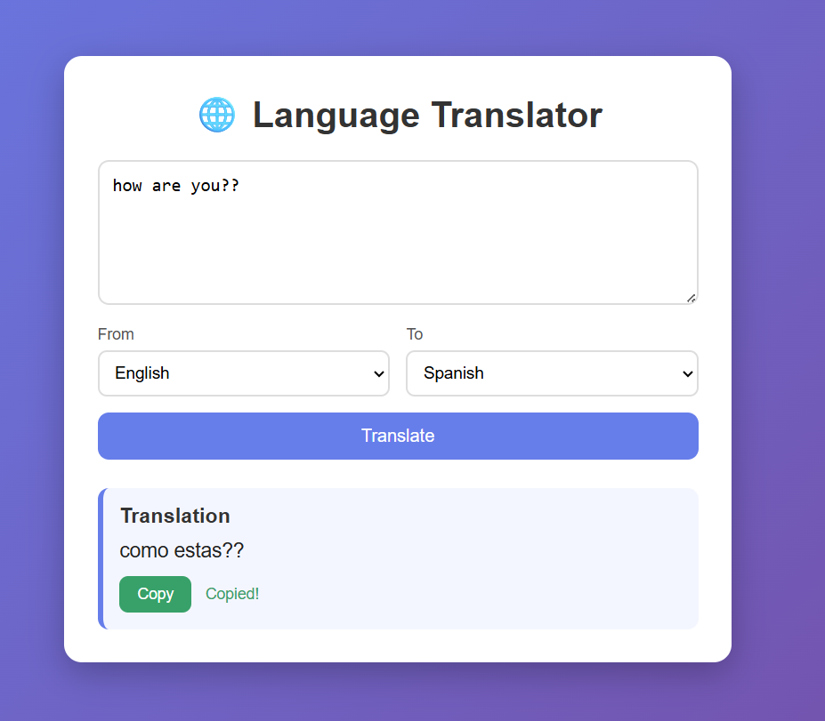

# 🌐 Language Translation Tool

A web-based language translation tool built with **Python and Django** as part of my **CodeAlpha Artificial Intelligence Internship (Task 1)**.

Users can enter text, choose the source and target languages, and instantly get the translated text.

## Screenshot



## Features

- Translate text between 100+ languages
- Auto-detect source language
- Clean and responsive user interface
- One-click **Copy** button for the translated text
- Automatic fallback: uses Google Translate first, and switches to MyMemory if Google is busy or rate-limited
- Right-to-left support for languages like Urdu and Arabic

## Tech Stack

- Python
- Django
- deep-translator (Google Translate and MyMemory)
- HTML, CSS, JavaScript

## How to Run

1. Clone the repository
```bash
   git clone https://github.com/aliahmedsani2004-prog/CodeAlpha_LanguageTranslationTool.git
   cd CodeAlpha_LanguageTranslationTool
```

2. Create and activate a virtual environment
```bash
   python -m venv venv
   venv\Scripts\activate
```
   (On Mac/Linux: `source venv/bin/activate`)

3. Install dependencies
```bash
   pip install -r requirements.txt
```

4. Go into the Django project folder and start the server
```bash
   cd CodeAlpha_LanguageTranslationTool
   python manage.py runserver
```

5. Open your browser and visit `http://127.0.0.1:8000/`

## How It Works

1. The user enters text and selects the source and target languages.
2. Django receives the form data in the view.
3. The view sends the text to Google Translate through `deep-translator`.
4. If Google fails, it falls back to MyMemory.
5. The translated text is displayed on the page.

## Note

The MyMemory fallback sometimes returns Urdu in Roman script instead of Urdu script. Google Translate gives proper Urdu script.

## Author

**Ali Sani**

CS Student, Bahria University Karachi

Built for the CodeAlpha AI Internship.